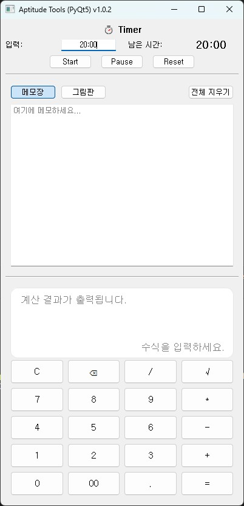
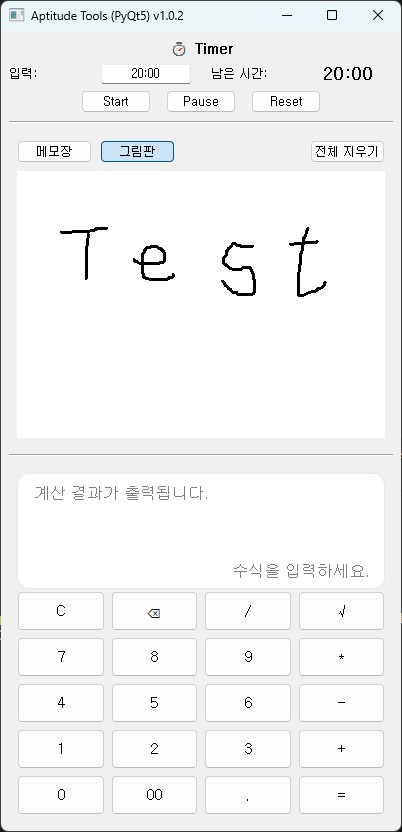

# 🧮 Aptitude Tools (PyQt5)

인적성 시험 연습을 위한 **계산기 + 메모장 + 그림판 + 타이머** 통합 데스크탑 도구입니다.

---

## 📦 Download
최신 실행 파일은 아래 링크에서 다운로드할 수 있습니다.  
[⬇️ Download Aptitude Tools v1.0.1](https://github.com/mavro7910/aptitude-tools-pyqt/releases/latest)

---

## 📁 Project Structure

```
aptitude-tools-pyqt/
├─ assets/
│ ├─ app_icon.ico # 빌드용 아이콘
│ ├─ beep.wav # 타임 종료 사운드
│ ├─ screenshots/
├─ gui/
│ ├─ init.py
│ ├─ gui.py # 전체 레이아웃
│ ├─ calculator.py # 계산기
│ ├─ notes_paint.py # 메모장/그림판
│ └─ timer.py # 타이머
├─ main.py # 진입점
├─ build_version.py # 빌드용 버전 정보
├─ requirements.txt
└─ README.md
```

---

## 📌 Features

| 기능 | 설명 |
|------|------|
| 🧾 **메모장 (Notepad)** | 시험 중 간단한 기록을 위한 메모 공간 제공 |
| 🎨 **그림판 (Paint)** | 마우스로 자유롭게 선을 그릴 수 있는 흑색 펜 캔버스 |
| 🧮 **계산기 (Calculator)** | 실제 인적성 계산기 UI 기반 실전형 계산 기능 |
| 🔄 **모드 전환** | 상단에서 메모장 ↔ 그림판 전환 가능 |
| 🧹 **전체 지우기 버튼** | 현재 활성 탭의 모든 내용을 한 번에 초기화 |
| 💡 **편의 기능** | CE, C, ⌫, ±, 00, √ 등 인적성 스타일 버튼 구성 |
| 🧠 **타이머 기능** | 시험 시간에 맞게 타이머 제공 |

---

## 🖼️ Screenshots


### 🧾 Timer + Notepad + Calculator


---

### 🎨 Timer + Paint + Calculator

---

## ⚙️ Installation

### 1️⃣ Clone this repository
```bash
git clone https://github.com/mavro7910/aptitude-tools-pyqt
cd aptitude-tools-pyqt
```

### 2️⃣ Install dependencies
```bash
pip install -r requirements.txt
```

---

## 🚀 Run
```bash
#./aptitude-tools-pyqt/
python main.py
```


## ⚙️ Build (Windows .exe 빌드)

```bash
#./aptitude-tools-pyqt/
# 기존에 빌드한 파일이 있다면...
Remove-Item -Recurse -Force .venv, build, dist
Remove-Item -Force *.spec
```

```bash
# 1️⃣ 새 가상환경 생성
python -m venv .venv
```

```bash
# 2️⃣ 가상환경 활성화
.venv\Scripts\activate
```

```bash
# 3️⃣ 필요한 패키지 설치
pip install -U pip setuptools wheel  # ERROR: To modify pip, please run the following command: 에러 발생 시 에러 내용 하단 명령어로 재설치
pip install -r requirements.txt
```

```bash
# 4️⃣ exe 빌드
python build_version.py; pyinstaller --noconsole --onefile --clean --name "AptitudeTools" --icon "assets/app_icon.ico" --add-data "assets;assets" --version-file "version_file.txt" main.py
```

```bash
# 5️⃣ 가상환경 비활성화
deactivate
#./dist에 build된 AptitudeTools.exe 사용 가능
```

---

실행 시 **상단 영역**은 메모장/그림판 전환용,  
**하단 영역**은 계산기로 구성됩니다.

---

## 🧠 Tech Stack
- **Language:** Python 3.10+
- **Framework:** PyQt5 (QtWidgets)
- **UI 구조:** QVBoxLayout / QStackedWidget 기반
- **Modules:** decimal, ast (수식 계산)

---

## ✨ Author
**이광호 (Kwangho Lee)**  
성균관대학교 기계공학부  

- GitHub: [@mavro7910](https://github.com/mavro7910)  
- Email: [kwangho97@g.skku.edu]

---

## 📜 License
MIT License  
Copyright © 2025 Kwangho Lee
