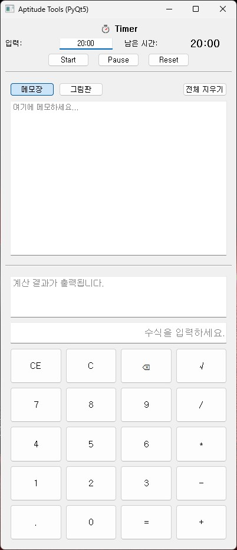
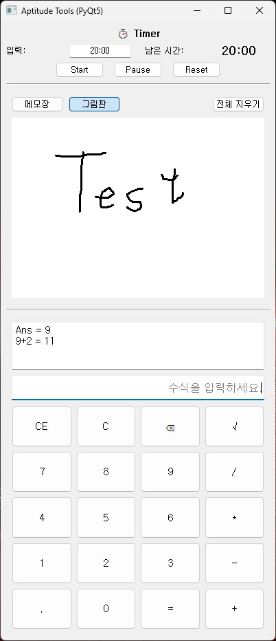

# 🧮 Aptitude Tools (PyQt5)

인적성 시험 연습을 위한 **계산기 + 메모장 + 그림판 + 타이머** 통합 데스크탑 도구입니다.

---

## 📁 Project Structure

```
aptitude-tools-pyqt/
├─ main.py                     # 실행 파일 (entry point)
├─ gui/
│  ├─ gui.py                   # 메인 윈도우 (UI 조합)
│  ├─ timer.py                 # 타이머 위젯
│  ├─ calculator.py            # 계산기 위젯
│  └─ notes_paint.py           # 메모장 및 그림판 위젯
├─ assets/                     # 스크린샷 저장 폴더
├─ README.md
├─ run_aptitude_tools.bat
├─ run_hidden.vbs              # Windows에서 빠른 실행파일
└─ requirements.txt
```

---

## 📌 Features

| 기능 | 설명 |
|------|------|
| 🧾 **메모장 (Notepad)** | 시험 중 간단한 기록을 위한 메모 공간 제공 |
| 🎨 **그림판 (Paint)** | 마우스로 자유롭게 선을 그릴 수 있는 흑색 펜 캔버스 |
| 🧮 **계산기 (Calculator)** | 실제 인적성 계산기 UI 기반 실전형 계산 기능 |
| 🔄 **모드 전환** | 상단에서 메모장 ↔ 그림판 전환 가능 |
| 🧹 **전체 지우기 버튼** | 현재 활성 탭의 모든 내용을 한 번에 초기화 |
| 💡 **편의 기능** | CE, C, ⌫, ±, 00, √ 등 인적성 스타일 버튼 구성 |
| 🧠 **타이머 기능** | 시험 시간에 맞게 타이머 제공 |

---

## 🖼️ Screenshots

### 🧾 Timer + Notepad + Calculator


---

### 🎨 Timer + Paint + Calculator

---

## ⚙️ Installation

### 1️⃣ Clone this repository
```bash
git clone https://github.com/mavro7910/aptitude-tools-pyqt
cd aptitude-tools-pyqt
```

### 2️⃣ Install dependencies
```bash
pip install -r requirements.txt
```

---

## 🚀 Run
```bash
python main.py
```

**Windows**에서는 `run_hidden.vbs`를 실행하면 바로 사용 가능합니다.

> 실행 시 **상단 영역**은 메모장/그림판 전환용,  
> **하단 영역**은 계산기로 구성됩니다.

---

## 🧠 Tech Stack
- **Language:** Python 3.10+
- **Framework:** PyQt5 (QtWidgets)
- **UI 구조:** QVBoxLayout / QStackedWidget 기반
- **Modules:** math, ast (수식 계산)

---

## ✨ Author
**이광호 (Kwangho Lee)**  
성균관대학교 기계공학부  

- GitHub: [@mavro7910](https://github.com/mavro7910)  
- Email: [kwangho97@g.skku.edu]

---

## 📜 License
MIT License  
Copyright © 2025 Kwangho Lee
